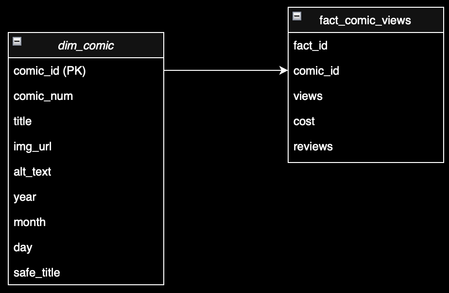

# XKCD ETL Project

This project automates the extraction, enrichment, and loading of comic data from [xkcd.com](https://xkcd.com), using **Airflow**, **PostgreSQL**, and **dbt** to build a lightweight data warehouse with validation.

---

## Architecture

- **Airflow**: orchestrates the ETL process.
- **PostgreSQL**: stores raw and transformed data.
- **dbt**: handles SQL transformations and data tests.
- **Docker Compose**: manages all services.

---

## Project Structure

```
├── airflow-init/
├── dags/ 
├── db/
├── dbt/
├── scripts/
├── docker-compose.yml 
├── Dockerfile 
```

---

## Kimball Model



---

## Data Quality Checks with dbt

The `fact_comics_summary` model includes:

- `not_null` checks
- Value ranges:
  - `views`: between 0 and 10,000
  - `cost`: greater than or equal to 0
  - `review`: between 1.0 and 10.0

---

## How to Run

### 1. Start services
```bash
docker compose up --build
```

### 2. Access Airflow
- URL: http://localhost:8080
- Username: `admin`
- Password: `admin`

### 3. Run the `xkcd_etl` DAG

This will:
- Extract the latest comic and a specific one
- Enrich the data
- Load to PostgreSQL

### 4. Run dbt manually

```bash
docker compose run --rm dbt debug
docker compose run --rm dbt run
docker compose run --rm dbt test
```

---

## DBT Layers Summary

### Staging (`stg_`)
- Raw load from PostgreSQL
- Applies renaming and typing

### Marts (`dim_comic_cleaned`, `fact_comics_summary`)
- Applies cleaning
- Business logic (`year > 2005`, `views > 100`)
- Ready for analytics

---